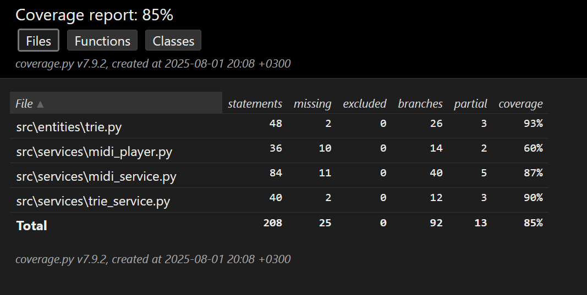

# Testausraportti

## Yksikkötestaus
Sovelluksen testaukseen käytetään Unittestiä. Automaattitestauksessa testataan entities- ja services-kansioiden luokat. Käyttöliittymän testaus jää yksikkötestauksen ulkopuolella. Automaattitesteillä testataan sovelluksen reagointia oikeanmuotoisilla syötteillä.

### Testikattavuus
()

## Käyttöliittymätestaus
Käyttöliittymätestaus on toteutettu manuaalisesti ja siinä keskitytty sovelluksen käytettävyyteen.

Käyttöliittymän osalta on testattu midi-tiedoston avaus, Markovin ketjun asteen määrittäminen, sen trie-rakenteeseen tallentaminen, nuottisekvenssin generoimiseen tarvittavan asteen määrittäminen, tempon ja kappaleen pituuden määrittäminen. Sekä satunnaisen aloitussekvenssin, kappaleen generoiminen, avatun midi-tiedoston soittamisen aloittaminen ja lopettaminen sekä trie-rakenteen nollaus toiminnot. Testaus pitkälti suoraviivaista, koska käyttöliittymän avulla lähinnä säädetään kappaleen generoimiseen tarvittavia parametreja ja toisaalta soitetaan generoitu kappale pygamen midi-soittimella, joka joko toimii tai ei.

Myöskin on testattu midi-tiedostoja, jotka eivät ole esikäsiteltyjä yksikanavaisiksi ja yhden nuotin sekvensseiksi ja tämä aiheuttaa virheitä sovelluksen toiminnassa.
